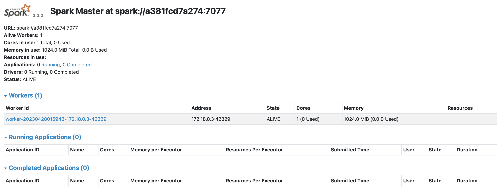

- [课件](#课件)
  - [1. 环境要求 Overview](#1-环境要求-overview)
  - [2. 部署Spark \& Spark Streaming](#2-部署spark--spark-streaming)
  - [3. 部署Anaconda，管理Python Runtime和Dependency](#3-部署anaconda管理python-runtime和dependency)
  - [4. 部署twitter code/pyspark/pandas等依赖](#4-部署twitter-codepysparkpandas等依赖)
  - [5. 执行代码](#5-执行代码)


# 课件
## 1. 环境要求 Overview

overview


OS：Mac、Windows

Anaconda：23.3.1

Python：3.8.10

Spark：3.3

Runtime：Java 1.8+




## 2. 部署Spark & Spark Streaming

- 下载Spark

https://spark.apache.org/docs/latest/

- Start StandAlone Spark Cluster（WebUI：localhost:8080）

```
./sbin/start-master.sh
```

- Add Worker

```
./sbin/start-worker.sh <master-spark-URL>
```

- 验证Spark部署是否正常（Job UI：localhost:4040）

```shell
./bin/spark-submit --master spark://xxxx:7077   examples/src/main/python/pi.py 100
```

- Spark-Streaming Guide

https://spark.apache.org/docs/latest/streaming-programming-guide.html

- Structured Streaming Programming Guide

https://spark.apache.org/docs/latest/structured-streaming-programming-guide.html


## 3. 部署Anaconda，管理Python Runtime和Dependency

清华镜像：https://mirrors.tuna.tsinghua.edu.cn/anaconda/miniconda/

官网：https://www.anaconda.com/download


Windows安装教程：https://blog.csdn.net/fan18317517352/article/details/123035625

- 下载Anacoda

- 安装

  **这一步注意选择**

  

- 配置环境变量

  ```
  E:\Anaconda 
  E:\Anaconda\Scripts 
  E:\Anaconda\Library\mingw-w64\bin
  E:\Anaconda\Library\usr\bin 
  E:\Anaconda\Library\bin
  ```


Linux 安装教程：https://www.anaconda.com/download

Mac安装教程：https://mirrors.tuna.tsinghua.edu.cn/anaconda/miniconda/


- 确认安装完成

```
conda --version
conda 23.3.1
```

- 创建python环境

```
conda create -n spark-py python=3.9
```

- 激活环境

```shell
# Linux & MacOS 
source activate spark-py 

# Windows
activate spark-py
```

- 确认已切换成功

```shell
conda env list
```

-  查看依赖包列表

```shell
conda list
```

- 安装依赖包


```
conda install xxx
```

- 根据镜像源下载安装

```shell
conda install matplotlib -c xxxx  # 镜像源
conda install matplotlib = 版本号 -c xxxx
conda install --channel 网址地址 matplotlib = 版本号
```


## 4. 部署twitter code/pyspark/pandas等依赖

- 整理出来的依赖

```
certifi==2019.3.9
chardet==3.0.4
idna==2.8
numpy
oauthlib==3.0.1
pandas
pymongo==3.8.0
PySocks==1.7.0
python-dateutil==2.8.0
pytz==2019.1
requests==2.22.0
requests-oauthlib==1.2.0
six==1.12.0
tweepy==3.7.0
unicodecsv==0.14.1
urllib3==1.25.3
spacy
wordcloud
pyspark
```

- 安装依赖

```shell
pip install -r requirements.txt
```

验证时遇到一些问题，可以注释掉依赖的版本号，使用Conda进行安装

```shell
conda install xxx
```


## 5. 执行代码

> Spark Flow


> Arch


TODO：画一个架构流程图


Find More Info： https://nutao.github.io/

- **tweet.py**: 调试Twitter查询相关代码，获取[recent search endpoint](https://developer.twitter.com/en/docs/twitter-api/tweets/search/introduction)
  
  - **此处有坑**，search endpoint需要查阅doc：https://developer.twitter.com/en/docs/twitter-api/v1/tweets/search/api-reference/get-search-tweets
  - 如果不确定数据的格式，可以在日志中多print信息
  
- **run.py:** 调试Spark任务代码。注意SparkContext的更改

  - 由于部署Spark使用的cluter模式，在SparkContext构造器中，应传入cluster的master地址。

  - 从twitter中获取的数据，需要分词、计数，然后再通过传递给flask web app。需要改造代码，将前10的trends信息构造成webapp需要的格式，使用requests库发起请求。

    ```python
    def send_data_to_dashboard():
        top_10 = sorted(collections.items(), key=lambda x: x[1], reverse=True)[:10]
        words = []
        counts = []
        for word, count in top_10:
            words.append(word)
            counts.append(count)
            print("{}: {}".format(word, count))
    
        print(words)
        print(counts)
        # initialize and send the data through REST API
        try:
            url = 'http://localhost:5001/updateData'
            request_data = {'label': str(words), 'data': str(counts)}
            response = requests.post(url, data=request_data)
        except:
            e = sys.exc_info()[0]
            print("Error: %s" % e)
    ```

    

- 构建web app，存储分词统计结果，在前端进行展示。

   doc: https://dormousehole.readthedocs.io/en/latest/

  - 使用Conda安装Flask依赖
  
    ```shell
    conda install flask
    ```

  - 创建web app工程需要的目录
  
    ```shell
    (spark-py) ➜  streaming_data git:(main) ✗ tree dashboard
    dashboard
    ├── app.py
    ├── static
    │   └── Chart.js
    └── templates
        └── chart.html
    ```

  - 编写相关代码。。。

    **此处有坑**，由于Chart.js已经做过多次版本迭代，需要对模板代码进行改动。

    首先，直接引入cdn依赖
  
    ```html
    <script src="https://cdn.staticfile.org/Chart.js/3.9.1/chart.js"></script>
    ```

    然后，充血Chart上下文script。包括构造器和配置。需要查阅doc：https://www.runoob.com/chartjs/chartjs-type-bar.html
  
    ```javascript
    var data = {
                // labels: ['mango', 'apple', 'melon', 'cherry', 'Python', 'startups', 'bayarea', 'innovation','cybersecurity', 'kiwi'],
                labels: [],
                datasets: [{
                    axis: 'y',
                    label: '# of Mentions',
                    data: [],
                    // data: [5, 4, 4, 2, 2, 2, 2, 2, 2, 2],
                    backgroundColor: [
                        'rgba(255, 99, 132, 0.2)',
                        'rgba(54, 162, 235, 0.2)',
                        'rgba(255, 206, 86, 0.2)',
                        'rgba(75, 192, 192, 0.2)',
                        'rgba(153, 102, 255, 0.2)',
                        'rgba(255, 159, 64, 0.2)',
                        'rgba(255, 99, 132, 0.2)',
                        'rgba(54, 162, 235, 0.2)',
                        'rgba(255, 206, 86, 0.2)',
                        'rgba(75, 192, 192, 0.2)',
                        'rgba(153, 102, 255, 0.2)'
                    ],
                    borderColor: [
                        'rgba(255,99,132,1)',
                        'rgba(54, 162, 235, 1)',
                        'rgba(255, 206, 86, 1)',
                        'rgba(75, 192, 192, 1)',
                        'rgba(153, 102, 255, 1)',
                        'rgba(255, 159, 64, 1)',
                        'rgba(255,99,132,1)',
                        'rgba(54, 162, 235, 1)',
                        'rgba(255, 206, 86, 1)',
                        'rgba(75, 192, 192, 1)',
                        'rgba(153, 102, 255, 1)'
                    ],
                    borderWidth: 1
                }],
            };
            const config = {
                type: 'bar', // 设置图表类型
                data: data, // 设置数据集
                options: {
                    indexAxis: 'y',
                }
            };
    ```
  
    

主要关注内容：

- Streaming Data
- Spark相关的内容
- 项目用到的技术

